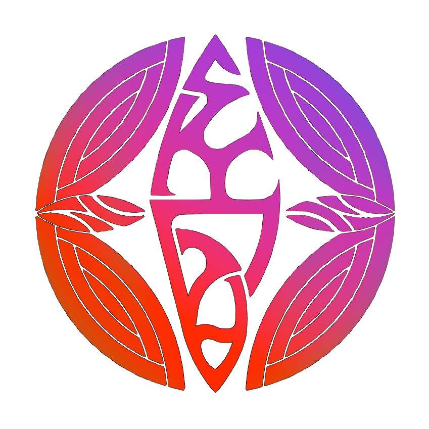

# Проекты

{ width=300 }

---

## БАРВИНSKY

**Период:** 2024 — настоящее время

### Описание

Проект БАРВИНSKY был реализован с нуля командой специалистов - биотехнологов
Наша миссия — предложить безопасную и эффективную альтернативу массовым продуктам через персонализацию и научный подход.

**НАША ЭКСПЕРТИЗА**:

Над каждым продуктом работают биотехнологи-косметологи 🔬. Мы совмещаем ручное производство с современными исследованиями, чтобы решать ваши косметические проблемы и подбирать уход индивидуально.

**СЕРТИФИЦИРОВАННОЕ КАЧЕСТВО**:

- ECOCERT — гарантирует органическое происхождение ингредиентов, их безопасность для человека и природы;
- COSMOS — строгий международный стандарт для натуральной косметики.

**ЭТИЧНЫЙ ПОДХОД**:

🌱 Sustainability — производство без опасных отходов;

🐇 Cruelty Free — никаких тестов на животных;

🌿 Экологичность — сохраняем ресурсы для будущих поколений.

**КАК ЭТО РАБОТАЕТ?**

Мы не продаём типовые средства. Ваш персональный уход создаётся в 4 этапа:

✔️ Анкетирование или консультация — анализируем ваши потребности.

✔️ Подбор компонентов — только сертифицированные ингредиенты.

✔️ Разработка формулы — уникальный состав для вашей кожи.

✔️ Доставка образца — по России за 1–3 дня.

ПОЧЕМУ ВЫБИРАЮТ НАС?

**Прозрачность** — в нашем сообществе разбираем состав популярных средств и объясняем, как работают компоненты 🧪;

**Доверие** — сертификаты ECOCERT и COSMOS подтверждают безопасность;

**Ответственность** — этичное изготовление и бережное отношение к природе.

### Ключевые этапы работы над проектом

**Разработка и создание инфраструктуры проекта:**

  - регистрация деятельности
  - оборудование и подготтовка помещения
  - формирование базы данных
  - создание собственных методик производства
  - создание и тестирование образцов

**Маркетинг и поиск клиентов**
 
  - формирование лица бренда 
  - создание стратегии и тактики продвижения
  - создание контента
  - настраивание каналов продвижения 
  - подключение рекламы

**Взаимодействие с клиентами**

  - Настройка автоматических инструментов для коммуникации
  - Проведение онлайн и оффлайн консультаций

### Технологии и инструменты
`Microsoft Excel` 

`Telegram` `VK для бизнеса` 

`VK-приложения` 

`Творческая студия YouTube` 

`Movavi`

---
