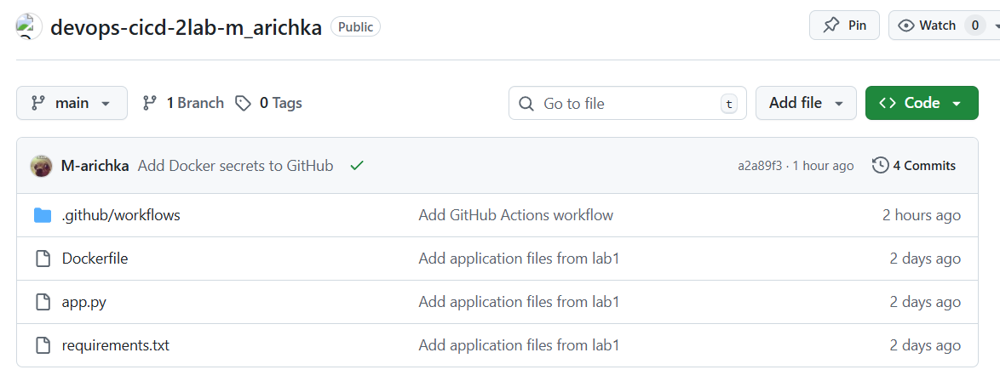
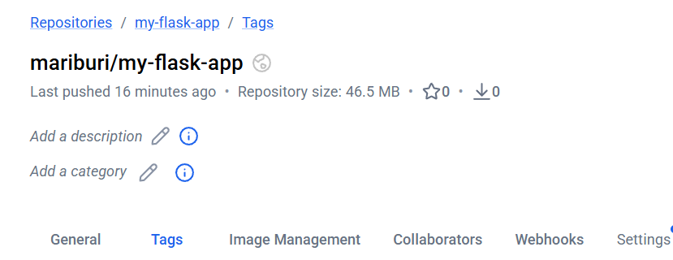
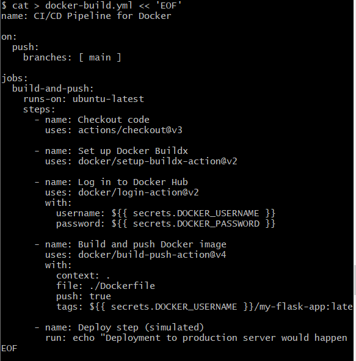
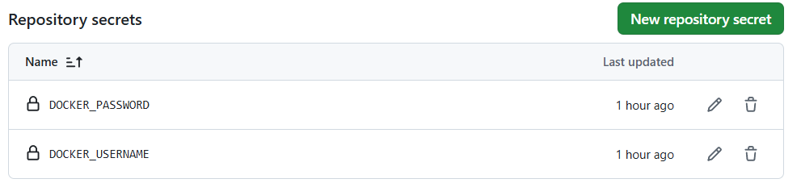
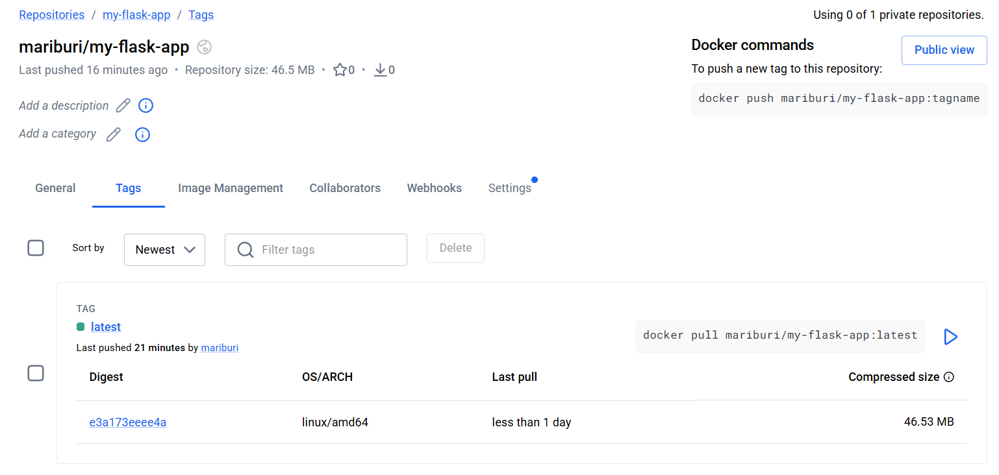
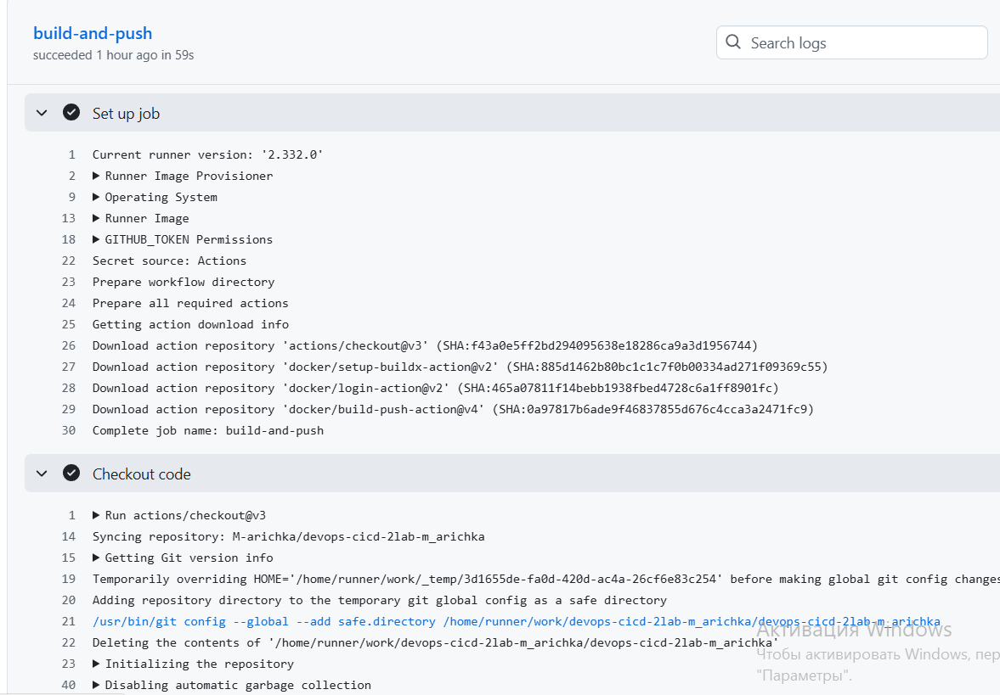
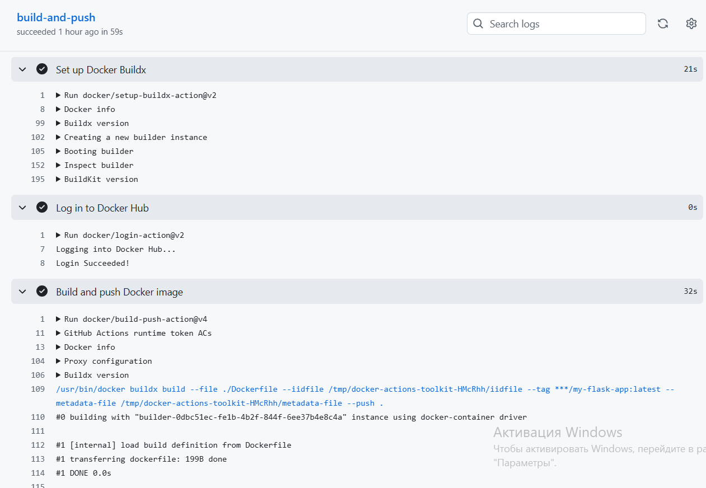
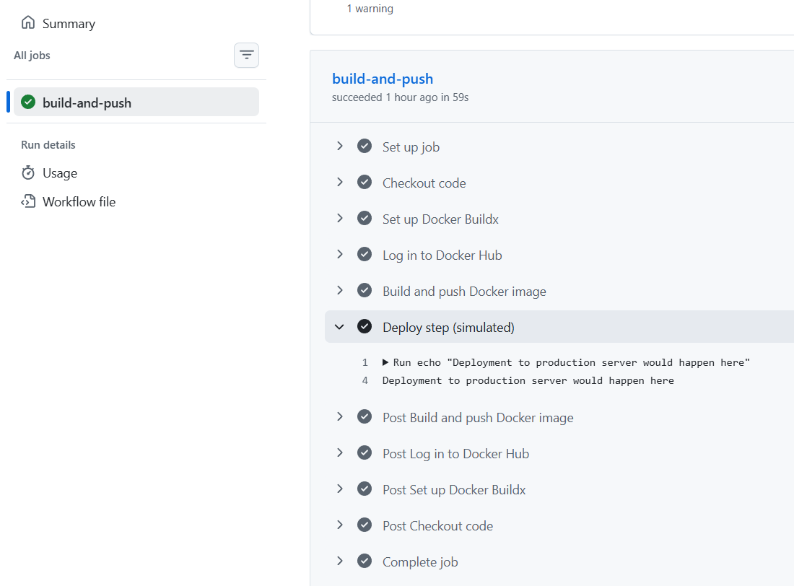

University: [ITMO University](https://itmo.ru/ru/)\
Faculty: [FICT](https://fict.itmo.ru)\
Course: [Введение в веб технологии](https://itmo-ict-faculty.github.io/introduction-in-web-tech/)\
Year: 2025/2026\
Group: U4125\
Author: Barvinskaya Mariya Borisovna \
Lab: Lab2\
Date of create: 09.03.2026\
Date of finished:\

# Ход работы
1) Создала новый реп на Git Hub: https://github.com/M-arichka/devops-cicd-2lab-m_arichka с файлами  (app.py, requirements.txt, Dockerfile) \

3) Создала аккаунт на Docker Hub и репозиторий: \
 \
4) Произвела настройку GitHub Actions: Создала папку .github/workflows/ в корне проекта, создала файл docker-build.yml с пайплайном, который: \
Запускаеться при пуше в main ветку \
Использует Ubuntu как runner \
Выполняет checkout кода \
Настраивает Docker Buildx \
Логинится в Docker Hub используя секреты \
Собирает и пушит образ с тегом username/my-flask-app:latest \
Добавляет шаг деплоя \
 \
5) Настроила секреты: \
 \
6) Сделала коммит и пуш в ветку main, произошло выполнение пайплайна в Actions, появился образ на Docker Hub: \
 \
5) Проверила логи выполнения каждого шага \
Фото 5,6,7 \

  
