University: [ITMO University](https://itmo.ru/ru/)\
Faculty: [FICT](https://fict.itmo.ru)\
Course: [Введение в веб технологии](https://itmo-ict-faculty.github.io/introduction-in-web-tech/)\
Year: 2025/2026\
Group: U4125\
Author: Barvinskaya Mariya Borisovna \
Lab: Lab3\
Date of create: 13.03.2026\
Date of finished:\

# Ход работы
1) Создала файл prometheus/prometheus.yml с информацией о частоте сбора метрик, метриками prometheus и метриками системы \
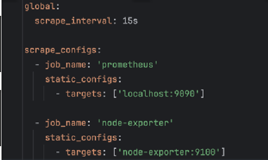 \
3) Запустила контейнер Node Exporter и проверила его работу: \
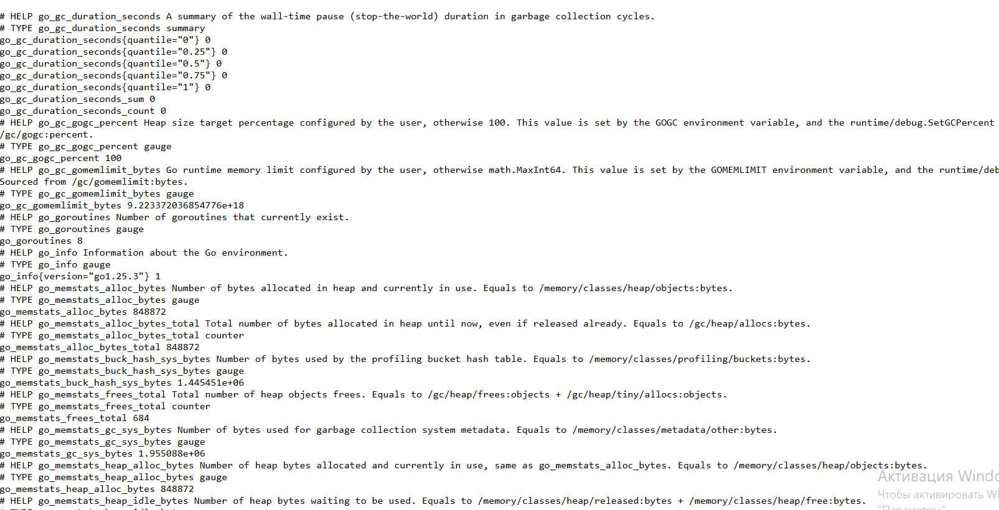 \
4) Создала том prometheus-data, для работы с grafana создала общую сеть monitoring \
5) Работа prometheus на локальном хосте: \
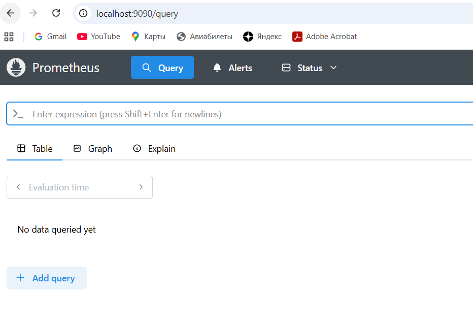 \
6) Создала том grafana-data и запустила контейнер: \
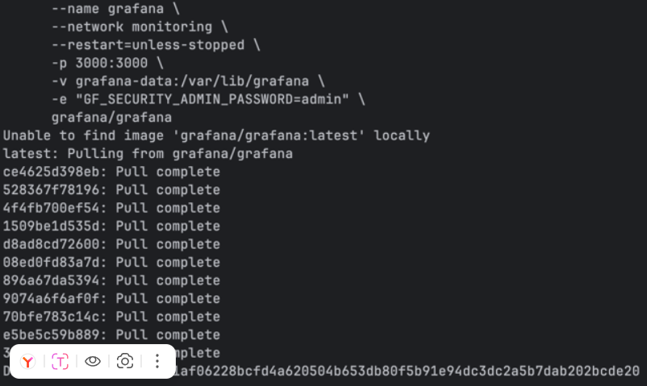 \
7) На локальном хосте графана работает: \
 \
8) Залогинилась под админом в графане, добавила источник данных prometheus: \
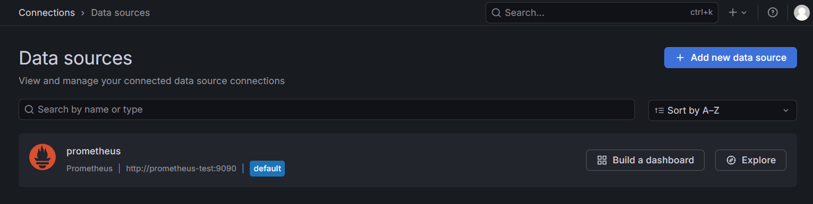 \
9) В prometheus проверила доступность node-exporter: \
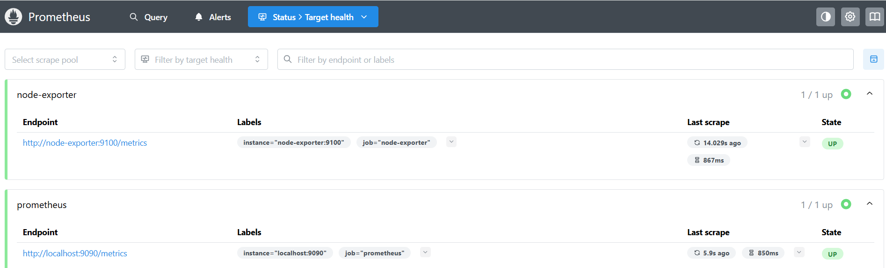 \
10) Сздала дашборд, добавила метрику node_cpu_seconds_total, сохранила: \
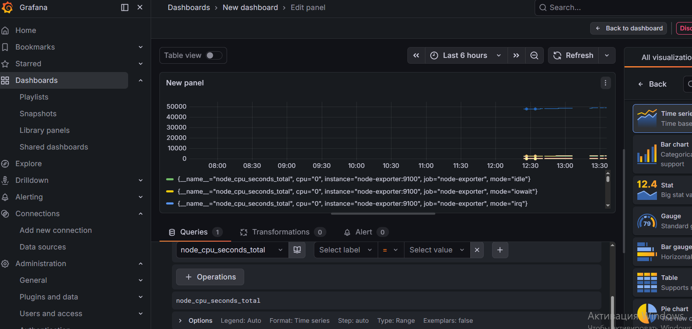 \
11) Добавила метрики node_memory_MemTotal_bytes, node_load1, node_memory_Active_bytes, node_disk_io_now...:  \
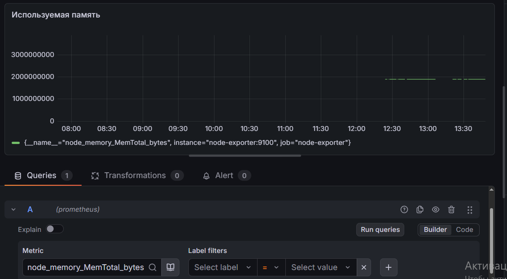
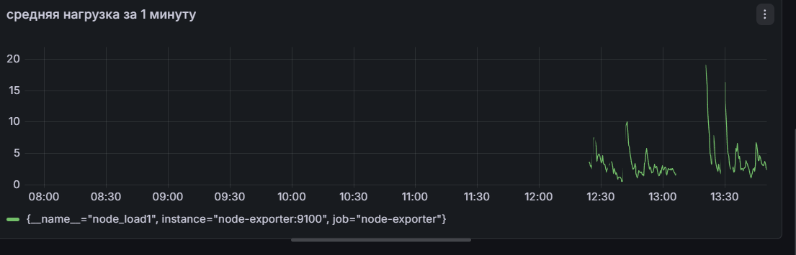
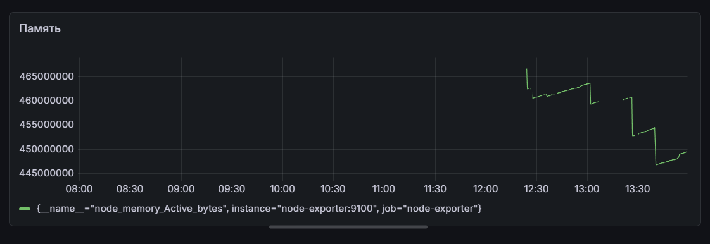
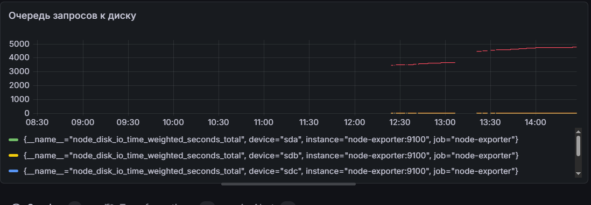
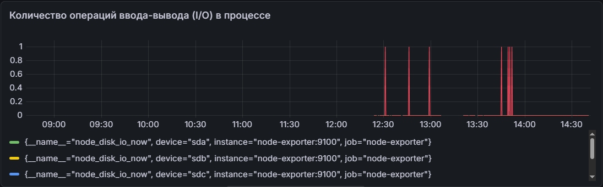 \
12) Метрики собираются, данные визуализируются \

Трудности: долго мучилась с заапуском Prometheus. Через Git Bash не получалось, разбиралась с логами: все время выдавал "Error loading config". Получилось запустить через командную строку (cmd) 
